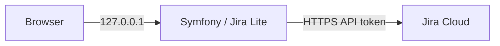

# Jira Lite

[](https://github.com/tblt-gr/jira-lite/actions/workflows/ci.yml)
[](https://www.php.net/)
[](https://symfony.com/)
[](LICENSE)

Jira Lite is a fast, **local** interface for the Jira workflows used every day: browse boards, filter epics, inspect issues, comment, log work, and transition status without loading Jira’s full UI.



## Features

- Fast board navigation with filters, epics and delta refresh.
- Issue details, rich-text comments, mentions, attachments and worklogs.
- Inline issue editing and keyboard-accessible status transitions.
- French and English interface.
- Server-side Jira media proxy that keeps credentials out of the browser.

## Quick start

Docker is the recommended local runtime:

```bash
cp .env.example .env.local
# Fill JIRA_BASE_URL, JIRA_EMAIL, JIRA_API_TOKEN and APP_SECRET in .env.local
docker compose up -d
```

Open <http://127.0.0.1:5472>. The development compose file mounts the source code and runs in `dev` mode.

For a compiled, day-to-day local runtime, use:

```bash
docker compose -f compose.prod.yaml up -d
```

Without Docker, install dependencies and use PHP’s built-in server:

```bash
composer install
php -S 127.0.0.1:8000 -t public public/index.php
```

## Configuration

Copy `.env.example` to `.env.local`; never commit it.

| Variable | Required | Default | Description |
|---|---:|---|---|
| `APP_ENV` | no | `dev` | Symfony environment. |
| `APP_SECRET` | yes | — | Random Symfony application secret. |
| `DEFAULT_URI` | no | `http://localhost` | Base URI used by Symfony. |
| `TRUSTED_HOSTS` | no | loopback regex | Host allowlist protecting against DNS rebinding. |
| `JIRA_BASE_URL` | yes | — | Jira Cloud instance URL. |
| `JIRA_EMAIL` | yes | — | Jira account email used by the server. |
| `JIRA_API_TOKEN` | yes | — | Jira API token used by the server. |
| `JIRA_STORY_POINTS_FIELD` | no | `customfield_10016` | Primary story-points custom field. |
| `JIRA_FALLBACK_STORY_POINTS_FIELD` | no | `customfield_10026` | Fallback story-points custom field. |
| `BIND_ADDRESS` | no | `127.0.0.1` | Docker published address; keep the loopback default. |
| `PORT` | no | `5472` | Docker host port. |

Generate a secret with `php -r "echo bin2hex(random_bytes(32)), PHP_EOL;"`.

## Architecture

The Symfony application exposes HTML pages and a small `/api/jira` API. Controller classes stay thin; Jira repositories own remote calls, DTOs represent board data, and browser code is split into ES modules under `assets/board/`. No database is required: Jira remains the source of truth and short-lived snapshots smooth remote API latency.

## Development and tests

Requirements: PHP 8.5+, Composer, Node.js, Docker (recommended), and a Jira Cloud API token for manual integration checks.

```bash
composer install
npm ci
composer check
npm run lint
npm test
```

`composer check` validates Composer metadata, Symfony configuration, translations, Twig templates, coding style, PHPStan and PHPUnit. JavaScript is served by AssetMapper; Node.js is only used for linting and tests.

## Scope and security

Jira Lite is a **local** tool. It listens on `127.0.0.1`, protects writes with a CSRF token, and accepts only hosts declared in `TRUSTED_HOSTS`. Application authentication is deliberately out of scope; see [ADR-0002](docs/adr/0002-no-application-authentication.md). To expose the service beyond the workstation, add at minimum authentication, TLS, and a reverse proxy.

Do not commit `.env.local`, Jira credentials, or API tokens. See [SECURITY.md](SECURITY.md) for the complete local threat model and reporting guidance.

## Architecture decisions

The project records its key trade-offs in [Architecture Decision Records](docs/adr/), including the local-only boundary, no application authentication, no database, and the server-side media proxy.

## Known limitations

- One configured Jira identity is used for all requests.
- The service is intentionally single-user and local-only.
- It targets Jira Cloud APIs and needs valid instance-specific custom-field configuration when defaults differ.

## License

Jira Lite is released under the [MIT License](LICENSE).
