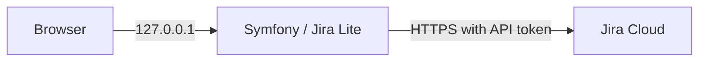

<h1 align="center">Jira Lite</h1>
<h4 align="center">A fast, local-first interface for everyday Jira board workflows.</h4>

<p align="center">
<a href="https://github.com/tblt-gr/jira-lite/actions/workflows/ci.yml"></a>
<a href="https://www.php.net/"></a>
<a href="https://symfony.com/"></a>
<a href="./LICENSE"></a>
</p>

<hr>
<p align="center">
<a href="#status">Status</a> &bull;
<a href="#features">Features</a> &bull;
<a href="#stack">Stack</a> &bull;
<a href="#quick-start">Quick Start</a> &bull;
<a href="#configuration">Configuration</a> &bull;
<a href="#development">Development</a> &bull;
<a href="#security">Security</a> &bull;
<a href="#contributing">Contributing</a>
</p>
<hr>

Jira Lite keeps the frequently used Jira board actions close at hand: browse boards, filter epics,
inspect issues, comment, log work and transition status—without loading Jira’s full interface.
It is intentionally designed for **local, single-user use**.

## Status

Jira Lite is actively maintained. The `main` branch is protected by PHP, JavaScript and production
Docker checks. It targets PHP 8.5 and Symfony 7.4.

## Features

- **Board navigation** with column, version, issue-type and epic filters
- **Issue workspace** with description, fields, links, attachments and image preview
- **Collaboration actions**: comments, mentions, worklogs and inline edits
- **Workflow transitions** through a keyboard-accessible status picker
- **Fresh data** through short-lived snapshots and delta polling
- **French and English** UI
- **Safe media proxy**: Jira credentials never reach the browser

## Stack

| Layer | Technology |
| --- | --- |
| Backend | PHP 8.5 · Symfony 7.4 · Twig · Monolog |
| Frontend | ES modules · Stimulus · AssetMapper · CSS |
| Quality | PHPUnit · PHPStan level 8 · PHP CS Fixer · ESLint · Node test runner |
| Runtime | FrankenPHP · Docker Compose · GitHub Actions |
| Integration | Jira Cloud REST API · server-side media proxy |

## Architecture



Jira is the source of truth. Jira Lite has no database: repositories encapsulate Jira calls, DTOs
shape board data, and short-lived snapshots keep navigation responsive.

## Quick Start

### Docker

```bash
cp .env.example .env.local
# Set APP_SECRET, JIRA_BASE_URL, JIRA_EMAIL and JIRA_API_TOKEN in .env.local
docker compose up -d
```

Open <http://127.0.0.1:5472>. This development profile mounts the source code and runs with
`APP_ENV=dev`.

For an immutable, compiled local runtime:

```bash
docker compose -f compose.prod.yaml up -d
```

### Local PHP

```bash
composer install
php -S 127.0.0.1:8000 -t public public/index.php
```

## Configuration

Copy `.env.example` to `.env.local`; real environment files and Jira credentials must never be
committed.

| Scope | Variable | Description | Default |
| --- | --- | --- | --- |
| Shared | `APP_ENV` | Symfony environment | `dev` |
| Shared | `APP_SECRET` | Random Symfony application secret | — |
| Shared | `DEFAULT_URI` | Symfony base URI | `http://localhost` |
| Shared | `TRUSTED_HOSTS` | Loopback host allowlist | loopback regex |
| Jira | `JIRA_BASE_URL` | Jira Cloud instance URL | — |
| Jira | `JIRA_EMAIL` | Server-side Jira account email | — |
| Jira | `JIRA_API_TOKEN` | Server-side Jira API token | — |
| Jira | `JIRA_STORY_POINTS_FIELD` | Primary story-points custom field | `customfield_10016` |
| Jira | `JIRA_FALLBACK_STORY_POINTS_FIELD` | Fallback story-points custom field | `customfield_10026` |
| Docker | `BIND_ADDRESS` | Published address; keep loopback | `127.0.0.1` |
| Docker | `PORT` | Local host port | `5472` |

Generate a secret with:

```bash
php -r "echo bin2hex(random_bytes(32)), PHP_EOL;"
```

## Development

```bash
make install  # Composer and Node dependencies
make check    # Composer check and JavaScript lint
make test     # PHPUnit and JavaScript tests
make up       # Docker development profile
make down     # Stop the profile
make help     # List all available targets
```

Equivalent direct commands remain available:

```bash
composer check
npm run lint
npm test
```

`composer check` validates Composer metadata, Symfony configuration, translations, Twig templates,
coding style, PHPStan and PHPUnit. Node.js is used for linting and tests only; AssetMapper serves
the browser modules.

## Security

Jira Lite is a **local** tool. It listens on `127.0.0.1`, protects writing routes with a stateless
CSRF token, limits Jira API requests, and accepts only hosts declared in `TRUSTED_HOSTS`.

Application authentication, TLS termination and multi-user authorization are intentionally out of
scope. If the service must be exposed beyond the workstation, add authentication, TLS and a reverse
proxy first. See [SECURITY.md](./SECURITY.md) and
[ADR-0002](./docs/adr/0002-no-application-authentication.md) for the complete rationale.

## Limitations

- One configured Jira identity is used for all requests.
- The application is single-user and local-only by design.
- Jira Cloud is required; custom fields may need instance-specific configuration.

## Contributing

Read [CONTRIBUTING.md](./CONTRIBUTING.md) before opening a pull request. Please include the
user-visible outcome, verification performed and screenshots for UI changes. Security reports must
follow [SECURITY.md](./SECURITY.md), not a public issue.

## License

[MIT](./LICENSE) © 2026 Jira Lite contributors.
