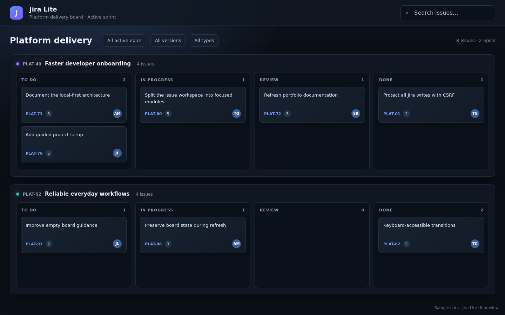
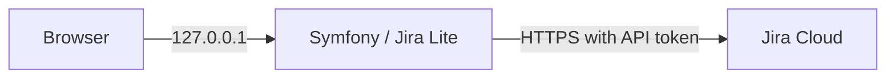

<h1 align="center">Jira Lite</h1>
<h4 align="center">A fast, local-first interface for everyday Jira board workflows.</h4>

<p align="center">
<a href="https://github.com/tblt-gr/jira-lite/actions/workflows/ci.yml"></a>
<a href="https://www.php.net/"></a>
<a href="https://symfony.com/"></a>
<a href="./LICENSE"></a>
</p>

<hr>
<p align="center">
<a href="#status">Status</a> &bull;
<a href="#features">Features</a> &bull;
<a href="#stack">Stack</a> &bull;
<a href="#quick-start">Quick Start</a> &bull;
<a href="#configuration">Configuration</a> &bull;
<a href="#development">Development</a> &bull;
<a href="#security">Security</a> &bull;
<a href="#contributing">Contributing</a>
</p>
<hr>

Jira Lite keeps the everyday Jira actions close at hand: create issues, browse boards, move issues
through the workflow, edit summaries and descriptions, comment, and log work—without loading Jira’s
full interface. It is intentionally designed for **local, single-user use**.



The product deliberately focuses on these common actions and a fast, simple interface. It is not
intended to reproduce Jira's administration, reporting, or advanced project-management features.

## Status

**This is a personal project.** It was built for my own needs, it is maintained for my own needs,
and there is no intention to deploy it to production, distribute it, or support its reuse by anyone
else. There is no roadmap, no compatibility promise between versions, and no guarantee that it fits
another Jira instance or workflow. Read it, fork it, take ideas from it—but treat it as someone
else's workstation tool, not as a product.

The `main` branch is protected by PHP, JavaScript and production Docker checks. It targets PHP 8.5
and Symfony 7.4.

## Features

- **Board navigation** with column, version, issue-type and epic filters
- **Issue creation** with type, summary, description, and optional sprint and epic
- **Issue workspace** with description, fields, links, attachments and image preview
- **Everyday updates**: edit summaries and descriptions, comment, mention people and log work
- **Workflow transitions** by moving cards or using a keyboard-accessible status picker
- **Fresh data** through short-lived snapshots and delta polling
- **French and English** UI
- **Safe media proxy**: Jira credentials never reach the browser

## Stack

| Layer | Technology |
| --- | --- |
| Backend | PHP 8.5 · Symfony 7.4 · Twig · Monolog |
| Frontend | ES modules · Stimulus · AssetMapper · CSS |
| Quality | PHPUnit · PHPStan level 8 · PHP CS Fixer · ESLint · Node test runner |
| Runtime | FrankenPHP · Docker Compose · GitHub Actions |
| Integration | Jira Cloud REST API · server-side media proxy |

## Architecture



Jira is the source of truth. Jira Lite has no database: repositories encapsulate Jira calls, DTOs
shape board data, and short-lived snapshots keep navigation responsive.

## Quick Start

### Docker

```bash
cp .env.example .env.local
# Set JIRA_BASE_URL, JIRA_EMAIL and JIRA_API_TOKEN in .env.local,
# or use the Symfony vault documented in the Configuration section.
docker compose up -d
```

Open <http://127.0.0.1:5472>. This development profile mounts the source code and runs with
`APP_ENV=dev`.

For an immutable, compiled local runtime:

```bash
docker compose -f compose.prod.yaml up -d
```

### Local PHP

```bash
composer install
php -S 127.0.0.1:8000 -t public public/index.php
```

## Configuration

Copy `.env.example` to `.env.local`; real environment files and Jira credentials must never be
committed.

| Scope | Variable | Description | Default |
| --- | --- | --- | --- |
| Shared | `APP_ENV` | Symfony environment | `dev` |
| Shared | `APP_SECRET` | Random Symfony application secret | generated automatically in Docker |
| Shared | `DEFAULT_URI` | Symfony base URI | `http://localhost` |
| Shared | `TRUSTED_HOSTS` | Loopback host allowlist | loopback regex |
| Jira | `JIRA_BASE_URL` | Jira Cloud instance URL | — |
| Jira | `JIRA_EMAIL` | Server-side Jira account email | — |
| Jira | `JIRA_API_TOKEN` | Server-side Jira API token | — |
| Jira | `JIRA_STORY_POINTS_FIELD` | Primary story-points custom field | `customfield_10016` |
| Jira | `JIRA_FALLBACK_STORY_POINTS_FIELD` | Fallback story-points custom field | `customfield_10026` |
| Docker | `BIND_ADDRESS` | Published address; keep loopback | `127.0.0.1` |
| Docker | `PORT` | Local host port | `5472` |

Docker generates `APP_SECRET` in the active Symfony vault when neither the environment, a `.env*`
file nor the vault already defines it. Existing values are never replaced. Without Docker, generate
it explicitly:

```bash
php bin/console secrets:generate-keys --env=dev
php bin/console secrets:set APP_SECRET --env=dev --random=64
```

### Symfony secrets vault

As an alternative to storing sensitive values in `.env.local`, Jira Lite can read them from
Symfony's encrypted secrets vault. The Sodium PHP extension required by the vault is included in
the Docker image.

Start the development container, which creates `APP_SECRET` automatically, then enter each Jira
value. Secret input is hidden, so the Jira token is not recorded in the shell history.

```bash
docker compose up -d
docker compose exec app php bin/console secrets:set JIRA_BASE_URL --env=dev
docker compose exec app php bin/console secrets:set JIRA_EMAIL --env=dev
docker compose exec app php bin/console secrets:set JIRA_API_TOKEN --env=dev
docker compose exec app php bin/console secrets:list --env=dev
```

For the immutable local production image, create a separate production vault before building it.
The image build creates its `APP_SECRET` automatically when the production vault does not already
contain one.

```bash
docker compose exec app php bin/console secrets:generate-keys --env=prod
docker compose exec app php bin/console secrets:set JIRA_BASE_URL --env=prod
docker compose exec app php bin/console secrets:set JIRA_EMAIL --env=prod
docker compose exec app php bin/console secrets:set JIRA_API_TOKEN --env=prod
docker compose exec app php bin/console secrets:list --env=prod
docker compose -f compose.prod.yaml up -d --build
```

Real environment variables and values from `.env.local` or `.env.<environment>.local` take
precedence over the vault. Remove duplicate definitions of these four names before relying on the
vault. This repository ignores `config/secrets/`, including the private decryption keys, so the
vault remains local to the workstation. Do not publish or share a production image containing a
local vault and its decryption key.

See the [Symfony secrets documentation](https://symfony.com/doc/7.4/configuration/secrets.html) for
key deployment, rotation and team-sharing workflows.

## Development

```bash
make install  # Composer and Node dependencies
make check    # Composer check and JavaScript lint
make test     # PHPUnit and JavaScript tests
make up       # Docker development profile
make down     # Stop the profile
make help     # List all available targets
```

Equivalent direct commands remain available:

```bash
composer check
npm run lint
npm test
```

`composer check` validates Composer metadata, Symfony configuration, translations, Twig templates,
coding style, PHPStan and PHPUnit. Node.js is used for linting and tests only; AssetMapper serves
the browser modules.

## Security

Jira Lite is a **local** tool. It listens on `127.0.0.1`, protects writing routes with a stateless
CSRF token, limits Jira API requests, and accepts only hosts declared in `TRUSTED_HOSTS`.

Application authentication, TLS termination and multi-user authorization are intentionally out of
scope. If the service must be exposed beyond the workstation, add authentication, TLS and a reverse
proxy first. See [SECURITY.md](./SECURITY.md) and
[ADR-0002](./docs/adr/0002-no-application-authentication.md) for the complete rationale.

The complete [architecture decision record](./docs/adr/README.md) explains the trade-offs behind
the local-only scope, persistence, frontend, media proxy, cache and refresh model.

## Limitations

- One configured Jira identity is used for all requests.
- The application is single-user and local-only by design.
- Jira Cloud is required; custom fields may need instance-specific configuration.
- Built for a single personal setup: it is not designed, tested or supported for production
  deployment or reuse in other environments.

## Contributing

External contributions are not expected. This is a personal project, feature requests are not
tracked, and pull requests may be closed without review. If you want it to behave differently, fork
it—that is the supported path.

[CONTRIBUTING.md](./CONTRIBUTING.md) documents the conventions the project holds itself to, which is
useful if you fork it or open a pull request anyway. Security reports must follow
[SECURITY.md](./SECURITY.md), not a public issue.

## License

[MIT](./LICENSE) © 2026 tblt-gr
